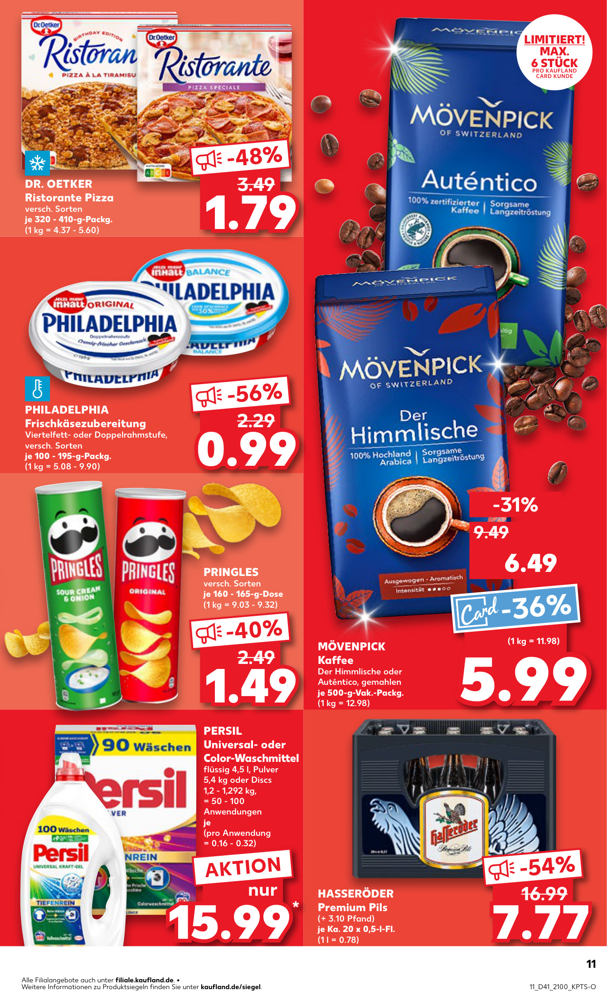
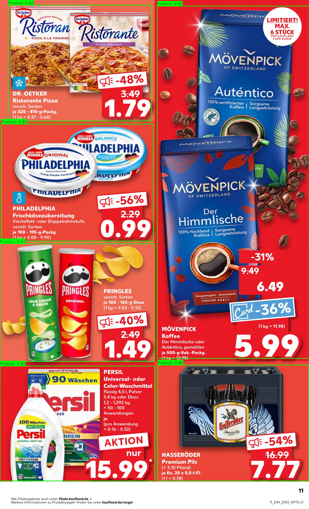
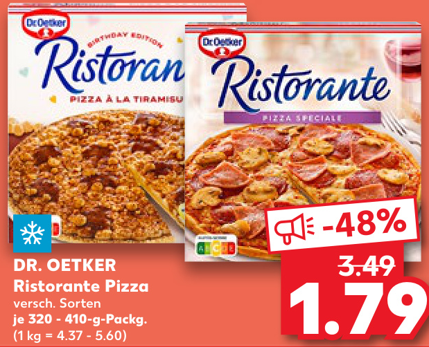

Selenium scrapes the current week's PDF or HTML flyers, the pages are rendered to JPEG, YOLOv11 runs detection on each page, and all crops plus metadata are stored in a time-stamped run folder. PaddleOCR then extracts text from the product and price crops, and a simple rule-based classifier assigns product categories. Finally, all data is sent through a Telegram bot for further use and analysis.

Left: a scraped weekly flyer page. Middle: the same page with detection boxes for products, prices and discounts. Right: an automatically exported crop used later for OCR and downstream analysis.
